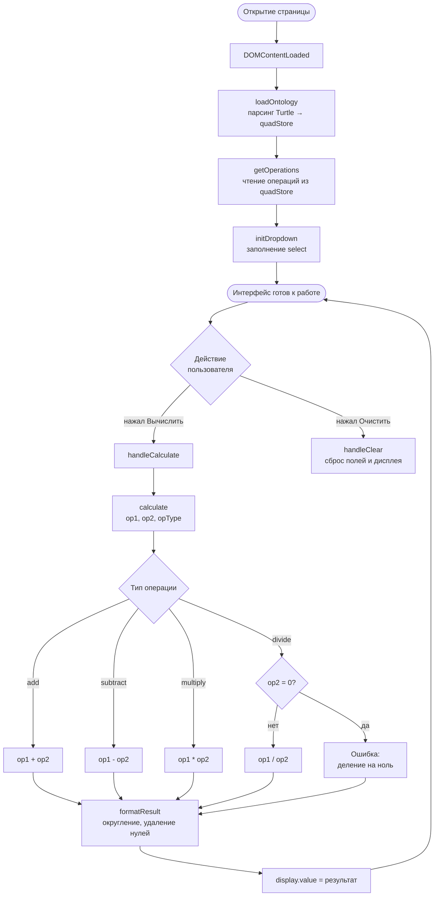
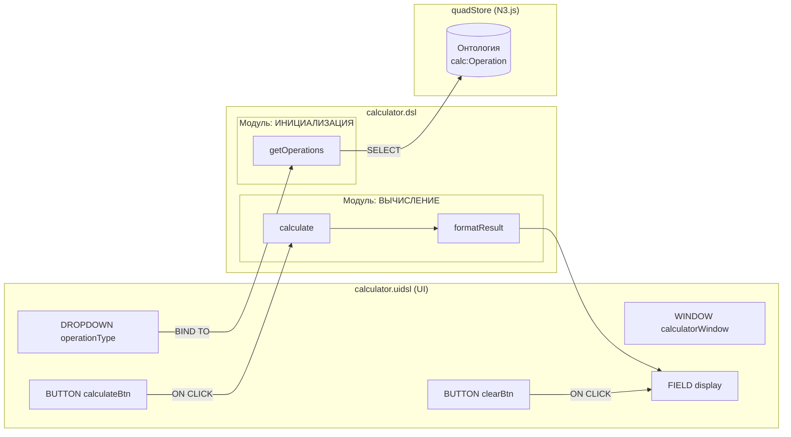
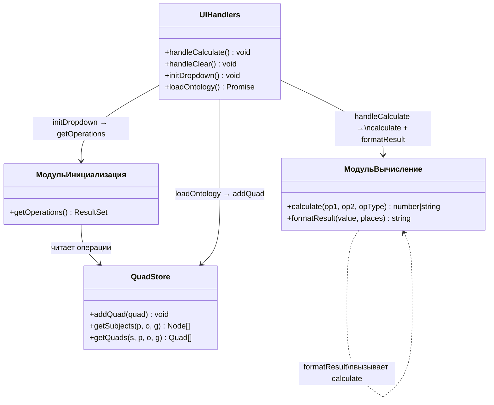

# Построение калькулятора с помощью DSL1 (ver2)

## Пошаговое руководство

*Аналог «Hello, Calculator» из BPMN Runa WFE, упрощённая версия.*

---

## Содержание

1. [Предварительные требования](#1-предварительные-требования)
2. [Структура проекта](#2-структура-проекта)
3. [Отличия от ver1](#3-отличия-от-ver1)
4. [Онтология калькулятора](#4-онтология-калькулятора)
5. [Код на DSL — модуль ИНИЦИАЛИЗАЦИЯ](#5-код-на-dsl--модуль-инициализация)
6. [Код на DSL — модуль ВЫЧИСЛЕНИЕ](#6-код-на-dsl--модуль-вычисление)
7. [UI DSL](#7-ui-dsl)
8. [Схема алгоритма и взаимодействия функций (Mermaid)](#8-схема-алгоритма-и-взаимодействия-функций-mermaid)
9. [Итоговый файл calculator.html](#9-итоговый-файл-calculatorhtml)
10. [Развёртывание на GitHub Pages](#10-развёртывание-на-github-pages)
11. [Устранение проблем](#11-устранение-проблем)

---

## 1. Предварительные требования

Для работы с ver2 **не требуется** Node.js или любой сервер.
Весь код — браузерный JavaScript, готовый к размещению на GitHub Pages.

| Инструмент | Назначение |
|-----------|-----------|
| Браузер (Chrome, Firefox, Edge) | Запуск и тестирование |
| Git | Контроль версий и публикация |
| Текстовый редактор | Правка .dsl, .uidsl, .html |

Внешние библиотеки подключаются через CDN в HTML-файле:

```html
<!-- N3.js — парсинг RDF и quadStore -->
<script src="https://unpkg.com/n3@1.17.2/browser/n3.min.js"></script>
```

---

## 2. Структура проекта

```
ver2/
└── examples/
    └── calculator/
        ├── calculator.dsl      ← логика на PL/SPARQL DSL
        ├── calculator.uidsl    ← описание интерфейса
        ├── calculator.html     ← итоговый файл (браузерный JS)
        └── instructions.md     ← это руководство
```

Онтология (описание типов данных) **встроена** в `calculator.html` в виде строки Turtle.
Отдельные `.ttl`-файлы в ver2 не нужны — всё в одном HTML.

---

## 3. Отличия от ver1

| Возможность | ver1 | ver2 |
|-------------|------|------|
| Среда выполнения | Node.js (для транслятора) | Только браузер |
| История вычислений | Есть (таблица последних 10) | Убрана |
| Статистика операций | Есть (Operation Frequency) | Убрана |
| Кнопка Clear History | Есть | Убрана |
| Хранение результатов в quadStore | Да | Нет (только онтология операций) |
| Модульность DSL | Один файл .dsl | Два явных модуля: ИНИЦИАЛИЗАЦИЯ и ВЫЧИСЛЕНИЕ |

---

## 4. Онтология калькулятора

Онтология описывает четыре операции как экземпляры класса `calc:Operation`.
Каждый экземпляр имеет:

| Свойство | Тип | Пример |
|----------|-----|--------|
| `calc:operationName` | строка | `"add"` |
| `calc:operationSymbol` | строка | `"+"` |
| `dsl:order` | целое | `1` |

Пример в синтаксисе Turtle:

```turtle
@prefix calc: <https://github.com/bpmbpm/DSL1/ontology/calculator#> .
@prefix dsl:  <https://github.com/bpmbpm/DSL1/ontology#> .
@prefix xsd:  <http://www.w3.org/2001/XMLSchema#> .

calc:addOperation
    a calc:Operation ;
    calc:operationName   "add" ;
    calc:operationSymbol "+" ;
    dsl:order            "1"^^xsd:integer .

calc:divideOperation
    a calc:Operation ;
    calc:operationName   "divide" ;
    calc:operationSymbol "/" ;
    dsl:order            "4"^^xsd:integer .
```

---

## 5. Код на DSL — модуль ИНИЦИАЛИЗАЦИЯ

Модуль ИНИЦИАЛИЗАЦИЯ содержит одну функцию `getOperations()`.
Она вызывается **один раз** при загрузке страницы и заполняет список операций.

```dsl
// Запрашиваем все операции, упорядоченные по dsl:order
FUNCTION getOperations() {
  SELECT ?op ?label ?symbol ?orderVal WHERE {
    GRAPH <calculator> {
      ?op a calc:Operation .
      ?op calc:operationName   ?label .
      ?op calc:operationSymbol ?symbol .
      ?op dsl:order            ?orderVal .
    }
  }
  ORDER BY ASC(?orderVal)
}
```

---

## 6. Код на DSL — модуль ВЫЧИСЛЕНИЕ

Модуль ВЫЧИСЛЕНИЕ содержит две функции.
Они вызываются **при каждом нажатии кнопки «Вычислить»**.

### FUNCTION calculate

```dsl
FUNCTION calculate(operand1, operand2, operationType) {

  // Проверка входных данных
  la-if (operand1 === null || operand2 === null) {
    return "Ошибка: введите оба числа"
  }
  la-if (operationType === null || operationType === "") {
    return "Ошибка: выберите операцию"
  }

  // Диспетчеризация по типу операции
  la-if (operationType === "add")      { return operand1 + operand2 }
  la-if (operationType === "subtract") { return operand1 - operand2 }
  la-if (operationType === "multiply") { return operand1 * operand2 }
  la-if (operationType === "divide") {
    la-if (operand2 === 0) { return "Ошибка: деление на ноль" }
    return operand1 / operand2
  }

  return "Ошибка: неизвестная операция: " + operationType
}
```

### FUNCTION formatResult

```dsl
FUNCTION formatResult(value, decimalPlaces) {
  la-if (typeof value === "string") {
    return value          // строки с ошибками — без изменений
  }
  let places = decimalPlaces === null ? 10 : decimalPlaces
  let rounded = ROUND(value, places)
  return STRING(rounded)  // убираем лишние нули
}
```

---

## 7. UI DSL

```dsl
WINDOW calculatorWindow {
  TITLE "Калькулятор"

  FIELD display { TYPE text  READONLY true  PLACEHOLDER "0" }
  FIELD operand1 { TYPE number  REQUIRED true }
  FIELD operand2 { TYPE number  REQUIRED true }

  // Список операций — заполняется через getOperations() (ИНИЦИАЛИЗАЦИЯ)
  DROPDOWN operationType {
    BIND TO getOperations()
    DISPLAY ?symbol
    VALUE   ?label
  }

  // Кнопка «Вычислить» — запускает ВЫЧИСЛЕНИЕ
  BUTTON calculateBtn {
    LABEL "Вычислить"
    ON CLICK {
      let rawResult     = calculate(operand1.value, operand2.value, operationType.value)
      let displayResult = formatResult(rawResult, 10)
      display.value     = displayResult
    }
  }

  BUTTON clearBtn {
    LABEL "Очистить"
    ON CLICK {
      operand1.value = ""  operand2.value = ""
      operationType.value = ""  display.value = ""
    }
  }
}
```

---

## 8. Схема алгоритма и взаимодействия функций (Mermaid)

### 8.1 Жизненный цикл приложения



### 8.2 Взаимодействие функций DSL и UIDSL



### 8.3 Модули DSL и их функции



---

## 9. Итоговый файл calculator.html

Файл `calculator.html` — единственный файл для запуска калькулятора.
Открывается напрямую в браузере или публикуется на GitHub Pages.

**Структура файла:**

```
calculator.html
├── <head>
│   ├── Подключение N3.js (CDN)
│   └── CSS-стили (встроены)
├── <body>
│   └── HTML-разметка интерфейса
└── <script>
    ├── Пространства имён RDF
    ├── quadStore (N3.Store)
    ├── Вспомогательные функции N3
    ├── Встроенная онтология (Turtle-строка)
    │
    ├── ЧАСТЬ 1: ИНИЦИАЛИЗАЦИЯ
    │   ├── loadOntology()    ← парсинг Turtle → store
    │   ├── getOperations()   ← DSL: FUNCTION getOperations
    │   └── initDropdown()    ← заполнение <select>
    │
    ├── ЧАСТЬ 2: ВЫЧИСЛЕНИЕ
    │   ├── calculate()       ← DSL: FUNCTION calculate
    │   ├── formatResult()    ← DSL: FUNCTION formatResult
    │   ├── handleCalculate() ← uidsl: ON CLICK calculateBtn
    │   └── handleClear()     ← uidsl: ON CLICK clearBtn
    │
    └── DOMContentLoaded → loadOntology → initDropdown
```

---

## 10. Развёртывание на GitHub Pages

1. Скопируйте папку `ver2/examples/calculator/` в свой репозиторий.
2. В настройках репозитория (Settings → Pages) выберите ветку и папку.
3. GitHub Pages опубликует файл по адресу:
   `https://<username>.github.io/<repo>/ver2/examples/calculator/calculator.html`

Node.js, npm, серверная часть — **не нужны**.

---

## 11. Устранение проблем

| Симптом | Причина | Решение |
|---------|---------|---------|
| Список операций пуст | Ошибка загрузки N3.js | Проверьте интернет-соединение; N3.js грузится с unpkg.com |
| «Ошибка: введите оба числа» | Поля не заполнены | Введите числа в оба поля |
| «Ошибка: деление на ноль» | Второй операнд = 0 | Измените второй операнд |
| Консоль: «Ошибка парсинга Turtle» | Повреждена встроенная онтология | Восстановите раздел `ontologyTurtle` из репозитория |
